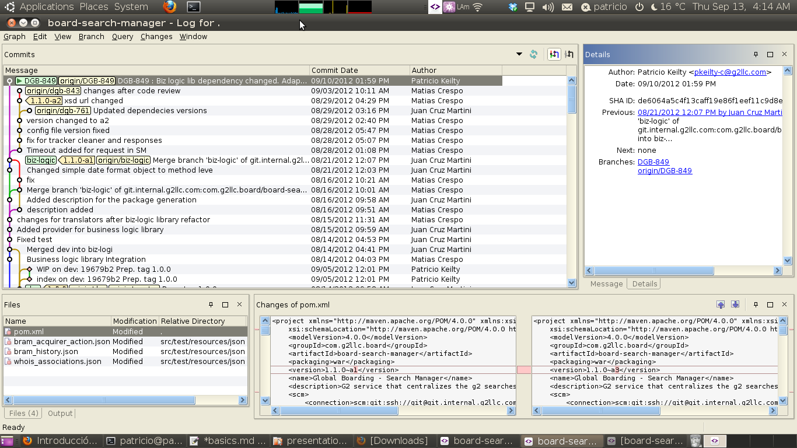

!SLIDE smaller
## Conectándose a un repo ##
* inicializando local

    $ git init
* clonar un repo remoto 

    $ git clone git://github.com/schacon/grit.git

!SLIDE smaller transition=fade
## .git directory ##

    $ tree .git
    .git
    |-- config
    |-- description
    |-- HEAD
    |-- hooks
    |   |-- commit-msg.sample
    |-- index
    |-- info
    |   `-- exclude
    |-- objects
    |   |-- info
    |   `-- pack
    `-- refs
        |-- heads
        `-- tags

!SLIDE commandline incremental
## Chequeando estado ##
nada que commitear

    $ git status
    # On branch master
    nothing to commit (working directory clean)

!SLIDE commandline incremental
## Chequeando estado ##

tengo modificaciones

    $ vim README
    $ git status
    # On branch master
    # Untracked files:
    #   (use "git add <file>..." to include in what will be committed)
    #
    #   README
    nothing added to commit but untracked files present (use "git add" to track)

!SLIDE commandline incremental
## Agregando nuevos files  ##

    $ git add README

    $ git status
    # On branch master
    # Changes to be committed:
    #   (use "git reset HEAD <file>..." to unstage)
    #
    #   new file:   README
    #

!SLIDE commandline incremental
## Subiendo modificaciones a staging  ##

    $ git status
    # On branch master
    # Changes to be committed:
    #   (use "git reset HEAD <file>..." to unstage)
    # 
    #   new file:   README
    #
    # Changed but not updated:
    #   (use "git add <file>..." to update what will be committed)
    # 
    #   modified:   benchmarks.rb
    # 
 
    $ git add benchmarks.rb
    $ git status
    # On branch master
    # Changes to be committed:
    #   (use "git reset HEAD <file>..." to unstage)
    # 
    #   new file:   README
    #   modified:   benchmarks.rb
    # 

!SLIDE commandline
## Ignorando cambios (.gitignore)  ##

    # a comment - this is ignored
    *.a       # no .a files
    !lib.a    # but do track lib.a, even though you're ignoring .a files above
    /TODO     # only ignore the root TODO file, not subdir/TODO
    build/    # ignore all files in the build/ directory
    doc/*.txt # ignore doc/notes.txt, but not doc/server/arch.txt

!SLIDE commandline smaller incremental
## Viendo los cambios  ##
    $ git status
    # On branch master
    # Changes to be committed:
    #   (use "git reset HEAD <file>..." to unstage)
    #
    #   new file:   README
    #
    # Changed but not updated:
    #   (use "git add <file>..." to update what will be committed)
    #
    #   modified:   benchmarks.rb
    #
 
    $ git diff
    diff --git a/benchmarks.rb b/benchmarks.rb
    index 3cb747f..da65585 100644
    --- a/benchmarks.rb
    +++ b/benchmarks.rb
    @@ -36,6 +36,10 @@ def main
               @commit.parents[0].parents[0].parents[0]
             end

    +        run_code(x, 'commits 1') do
    +          git.commits.size
    +        end
    +
             run_code(x, 'commits 2') do
               log = git.commits('master', 15)
               log.size

          
!SLIDE commandline smaller
## Viendo los cambios (staging) ##
          
    $ git diff --cached
    diff --git a/README b/README
    new file mode 100644
    index 0000000..03902a1
    --- /dev/null
    +++ b/README2
    @@ -0,0 +1,5 @@
    +grit
    + by Tom Preston-Werner, Chris Wanstrath
    + http://github.com/mojombo/grit
    +
    +Grit is a Ruby library for extracting information from a Git repository     

!SLIDE commandline smaller incremental
## Commiteando los cambios ##

    $ git commit

    # Please enter the commit message for your changes. Lines starting
    # with '#' will be ignored, and an empty message aborts the commit.
    # On branch master
    # Changes to be committed:
    #   (use "git reset HEAD <file>..." to unstage)
    #
    #       new file:   README
    #       modified:   benchmarks.rb
    ~
    ~
    ~
    ".git/COMMIT_EDITMSG" 10L, 283C

!SLIDE commandline smaller incremental
## Borrando ##

    $ git rm grit.gemspec
    rm 'grit.gemspec'
    $ git status
    # On branch master
    #
    # Changes to be committed:
    #   (use "git reset HEAD <file>..." to unstage)
    #
    #       deleted:    grit.gemspec
    #

!SLIDE commandline smaller
## Renombrando o moviendo ##

    $ git mv README.txt README
    $ git status
    # On branch master
    # Your branch is ahead of 'origin/master' by 1 commit.
    #
    # Changes to be committed:
    #   (use "git reset HEAD <file>..." to unstage)
    #
    #       renamed:    README.txt -> README
    #

git es suficientemente inteligente para detectarlo si no se lo informamos

    $ mv README.txt README
    $ git rm README.txt
    $ git add README

!SLIDE commandline smaller
## Deshaciendo último commit: commit --amend ##

    $ git commit -m 'initial commit'
    $ git add forgotten_file
    $ git commit --amend

!SLIDE commandline smaller
## Deshaciendo cambios: reset ##
supongamos este caso
    $ git add .
    $ git status
    # On branch master
    # Changes to be committed:
    #   (use "git reset HEAD <file>..." to unstage)
    #
    #       modified:   README.txt
    #       modified:   benchmarks.rb
    #

y queremos volver para atrás y no commitear benchmarks.rb

    $ git reset HEAD benchmarks.rb
    benchmarks.rb: locally modified
    $ git status
    # On branch master
    # Changes to be committed:
    #   (use "git reset HEAD <file>..." to unstage)
    #
    #       modified:   README.txt
    #
    # Changed but not updated:
    #   (use "git add <file>..." to update what will be committed)
    #   (use "git checkout -- <file>..." to discard changes in working directory)
    #
    #       modified:   benchmarks.rb
    #

!SLIDE commandline smaller
## Revisando la historia ##
### git log ###

    $ git log
    commit ca82a6dff817ec66f44342007202690a93763949
    Author: Scott Chacon <schacon@gee-mail.com>
    Date:   Mon Mar 17 21:52:11 2008 -0700

        changed the version number

    commit 085bb3bcb608e1e8451d4b2432f8ecbe6306e7e7
    Author: Scott Chacon <schacon@gee-mail.com>
    Date:   Sat Mar 15 16:40:33 2008 -0700

        removed unnecessary test code

    commit a11bef06a3f659402fe7563abf99ad00de2209e6
    Author: Scott Chacon <schacon@gee-mail.com>
    Date:   Sat Mar 15 10:31:28 2008 -0700

        first commit

otras alternativas de formateo del output:

    $ git log --stat
    
    $ git log -p -2

!SLIDE commandline smaller
## Revisando la historia ##
### herramientas visuales (SmartGit, GitX) ###

