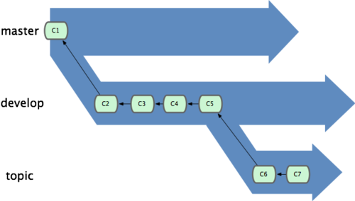
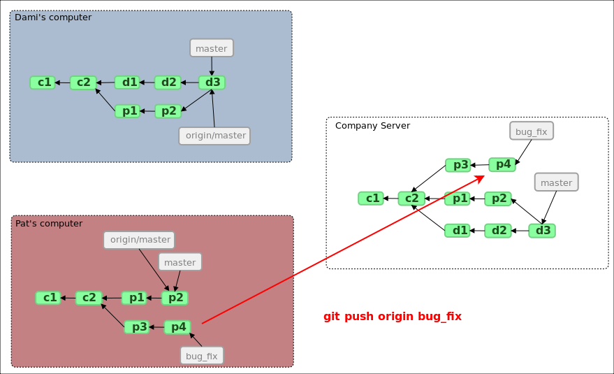
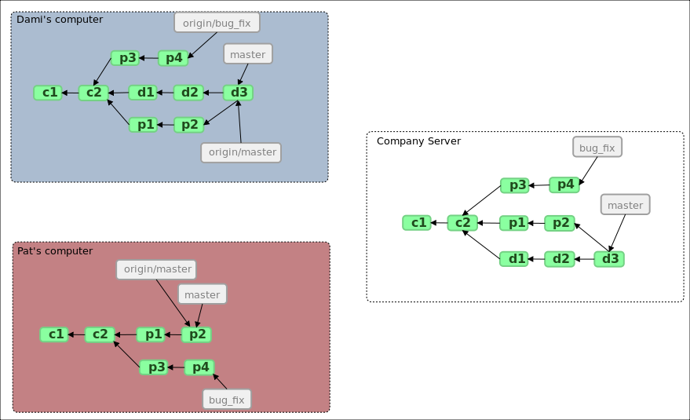

!SLIDE
##Qué es un branch para Git?##
Un branch en Git es un puntero ágil y móvil a un commit. El branch por default tiene por nombre master. Cuando comienzas a realizar commits, Git te provee un master branch que "apunta" al último commit. A medida que realices nuevos commits, ese puntero se irá moviendo hacia adelante automáticamente.

!SLIDE
## Branching básico##
Supongamos el siguiente escenario:
* estamos trabajando en un proyecto que ya posee algunos commits
* arrancamos a desarrollar una nueva story creando para ello una nueva rama de nombre "iss53"
* llega un requerimiento de resolver un bug de alta prioridad
* necesitamos abandonar momentaneamente la story para proveer un hotfix
* creamos un branch "hotfix", y una vez probado nuestro fix, se debe mergear e instalarse en producción
* volver a trabajar en la story

!SLIDE commandline smaller
## Historia del proyecto actual ##

!SLIDE commandline smaller
## Nueva rama iss53 ##
    $ git checkout -b iss53
    Switched to a new branch "iss53"

!SLIDE commandline smaller 
## Commiteamos en la nueva rama iss53 ##
    $ vim index.html
    $ git commit -a -m 'added a new footer [issue 53]'

observar como se mueve hacia adelante la referencia

!SLIDE commandline smaller
## Volviendo a master para trabajar en el fix ##
    $ git checkout master
    Switched to branch "master"

Git resetea el directorio de trabajo para que sea el mismo que corresponde al último commit en master.

!SLIDE commandline smaller
## Creamos el branch hotfix, y armamos el fix ##
    $ git checkout -b 'hotfix'
    Switched to a new branch "hotfix"
    
    
    $ vim index.html
    $ git commit -a -m 'fixed the broken email address'
    [hotfix]: created 3a0874c: "fixed the broken email address"
     1 files changed, 0 insertions(+), 1 deletions(-)

!SLIDE commandline smaller
## Listos para mergear el hotfix en master ##
    $ git checkout master
    $ git merge hotfix
    Updating f42c576..3a0874c
    Fast forward
     README |    1 -
     1 files changed, 0 insertions(+), 1 deletions(-)

listo para deployar en producción y volver a la story!

!SLIDE commandline smaller
## Vuelvo a la story ##
    
borra branch del hotfix

    $ git branch -d hotfix
    Deleted branch hotfix (3a0874c).

switchea al branch iss53
   
    $ git checkout iss53
    Switched to branch "iss53"
    $ vim index.html
    $ git commit -a -m 'finished the new footer [issue 53]'
    [iss53]: created ad82d7a: "finished the new footer [issue 53]"
     1 files changed, 1 insertions(+), 0 deletions(-)

!SLIDE commandline smaller
## Mergeando ##
Cómo puedo llevar la nueva funcionalidad al master?

    $ git checkout master
    $ git merge iss53
    Merge made by recursive.
     README |    1 +
     1 files changed, 1 insertions(+), 0 deletions(-)

!SLIDE commandline smaller
## Mergeando: en caso de conflicto##
Cuando los algoritmos de mergeo de Git no pueden resolver automáticamente avisan

    $ git merge iss53
    Auto-merging index.html
    CONFLICT (content): Merge conflict in index.html
    Automatic merge failed; fix conflicts and then commit the result.

    $ git status
    index.html: needs merge
    # On branch master
    # Changed but not updated:
    #   (use "git add <file>..." to update what will be committed)
    #   (use "git checkout -- <file>..." to discard changes in working directory)
    #
    #   unmerged:   index.html
    #

!SLIDE commandline smaller
## Mergeando: en caso de conflicto##
Se debe resolver manualmente o empleando alguna herramienta para merge (mergetool)

    $ git status
    # On branch master
    # Changes to be committed:
    #   (use "git reset HEAD <file>..." to unstage)
    #
    #   modified:   index.html
    #

!SLIDE commandline smaller
## Obteniendo info de los branches ##
Algunos comandos útiles

    $ git branch -v
      iss53   93b412c fix javascript issue
    * master  7a98805 Merge branch 'iss53'
      testing 782fd34 add scott to the author list in the readmes

para obtener los branches locales

    $ git branch --merged
      iss53
    * master

informa los branches que están mergeados en branch actual

    $ git branch --no-merged
      testing 

informa los branches que NO están mergeados 

    $ git branch --contains e5c2d6ec
    * master

imprime los branches que contienen el commit e5c2d6ec...

!SLIDE commandline smaller
## Branches: estrategias mas usadas ##
Branches de larga permanencia 

Topic branches por el contrario tiene muy corta vida

!SLIDE commandline smaller
## Rebasing vs Merge##

    $ git checkout experiment
    $ git rebase master
    First, rewinding head to replay your work on top of it...
    Applying: added staged command

toma el commit C3 y lo reaplica en el branch generando un nuevo commit C3'

!SLIDE
# Repositorios Remotos #
## Ejemplos de uso ##

!SLIDE
##Repo remoto##

.notes 42:00 video gallantgames

!SLIDE transition=fade
##Repo remoto##

!SLIDE transition=fade
##Repo remoto##

!SLIDE transition=fade
##Repo remoto##

!SLIDE transition=fade
##Repo remoto##

!SLIDE transition=fade
##Repo remoto##

!SLIDE transition=fade
##Repo remoto##

!SLIDE transition=fade
##Repo remoto##

!SLIDE transition=fade
##Repo remoto##

!SLIDE transition=fade
##Repo remoto##

!SLIDE transition=fade
##Repo remoto##

!SLIDE transition=fade
##Repo remoto##

!SLIDE transition=fade
##Repo remoto##

!SLIDE transition=fade
##Repo remoto##

!SLIDE transition=fade
##Repo remoto##

