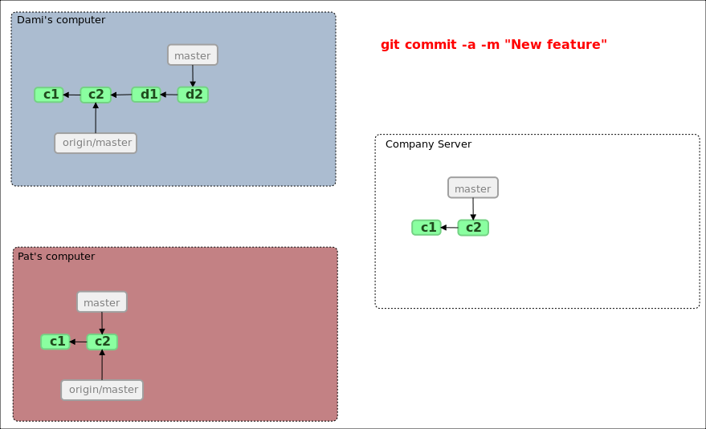
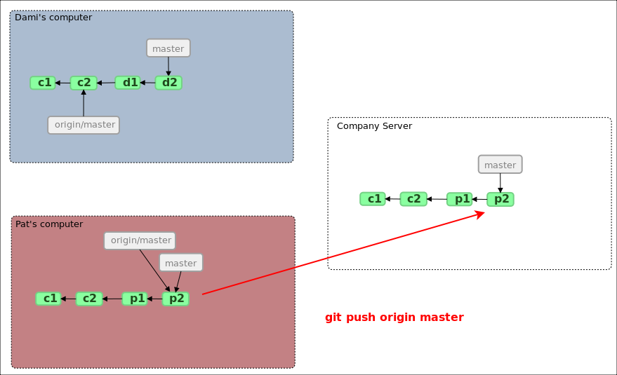

!SLIDE
## Respositorios remotos ##
Los repositorios remotos permiten compartir el código, básicamente son copias de ntra. base de objetos, para _sincronizarlos_ usamos: 

*push*, *fetch* (*pull*)

!SLIDE commandline smaller incremental
### Mostrando repos remotos (remote -v) ###

    $ git remote -v
    origin  git://github.com/schacon/ticgit.git

!SLIDE commandline smaller incremental
### Agregando repo remoto (remote add) ###

    $ git remote
    origin
    $ git remote add pb git://github.com/paulboone/ticgit.git
    $ git remote -v
    origin  git://github.com/schacon/ticgit.git
    pb  git://github.com/paulboone/ticgit.git

!SLIDE commandline smaller incremental
### Actualizando repo remoto (fetch) ###

    $ git fetch pb
    remote: Counting objects: 58, done.
    remote: Compressing objects: 100% (41/41), done.
    remote: Total 44 (delta 24), reused 1 (delta 0)
    Unpacking objects: 100% (44/44), done.
    From git://github.com/paulboone/ticgit
     * [new branch]      master     -> pb/master
     * [new branch]      ticgit     -> pb/ticgit

!SLIDE commandline smaller incremental
### Pusheando/subiendo cambios a repo remoto (push) ###

    $ git push origin master

!SLIDE commandline smaller incremental
### Info sobre repo remoto (remote show) ###

    $ git remote show origin
    * remote origin
      URL: git://github.com/schacon/ticgit.git
      Remote branch merged with 'git pull' while on branch master
        master
      Tracked remote branches
        master
        ticgit

!SLIDE
# Repositorios Remotos #
## Ejemplos de uso ##

!SLIDE
##Repo remoto##

.notes 42:00 video gallantgames

!SLIDE transition=fade
##Repo remoto##

!SLIDE transition=fade
##Repo remoto##

!SLIDE transition=fade
##Repo remoto##

!SLIDE transition=fade
##Repo remoto##

!SLIDE transition=fade
##Repo remoto##

!SLIDE transition=fade
##Repo remoto##

!SLIDE transition=fade
##Repo remoto##

!SLIDE transition=fade
##Repo remoto##

!SLIDE transition=fade
##Repo remoto##

!SLIDE transition=fade
##Repo remoto##

!SLIDE transition=fade
##Repo remoto##

!SLIDE transition=fade
##Repo remoto##

!SLIDE transition=fade
##Repo remoto##

!SLIDE transition=fade
##Repo remoto##

